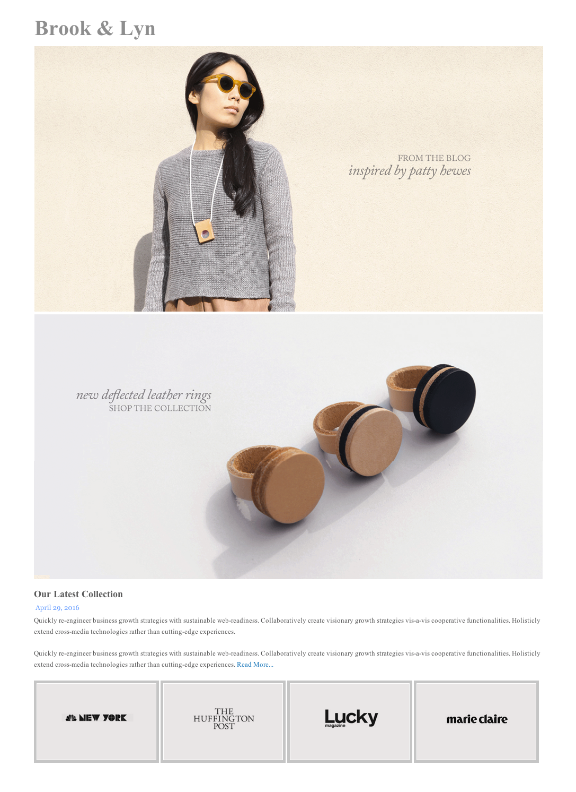

## Brook & Lyn: A layout exercise

The website of fashion brand Brook & Lyn has a simple layout. The visual elements live within a centered container, and the bottom row is laid out in the inline style.

#### Exercise Objectives

- Gain meaningful experience using HTML & CSS skills to build a complete layout
- Gain meaningful experience centering a container div
- Gain meaningful repetitions using `inline-block` to lay out a list of elements in a row

#### Directions

1. Write the HTML and CSS necessary to recreate the layout seen below.

#### Hints:

1. Look up and figure out the difference between display: inline; vs. display: inline-block;
2. Use relative pathing to link the pictures to your page.  Remember file structure.

Think of file structure as a list.

```
fun_things_folder
	>>index.html
		- folder_a
			>>pic.jpg
				I)
				>>pic2.jpg
		- folder_b
				I)
				II)
		- folder_c
				I)
				II)
				III)
					>>pic3.jpg
```
 
If I'm initially at fun_things_folder, and I need to link pic.jpg, I'd do this...

```

```

If I need to get to get pic3.jpg, I'd do this...

```

```

#### Layout

